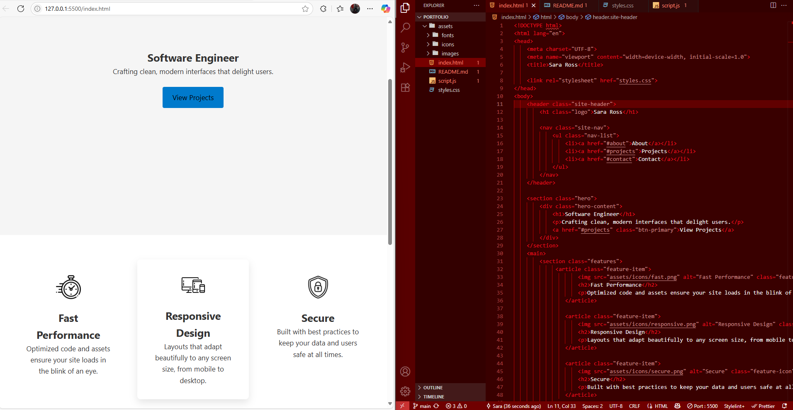

# 🌐 Sara Ross | Developer Portfolio

Welcome to my personal portfolio! This website is a showcase of my skills, projects, and creative work as a frontend and backend developer.

## 📁 Folder Structure

```bash
portfolio/
├── index.html
├── styles.css
├── script.js
├── assets/
│   ├── fonts/
│   ├── images/
│   └── icons/
├── screenshots/
│   ├── homepage.png
│   └── contact-form.gif
└── README.md
🛠️ Built With
HTML5, CSS3, JavaScript (ES6)

Git & GitHub

Formspree (Contact form integration)

Responsive Design principles

✨ Highlights
✨ Smooth, responsive layout across devices

🧩 Modular file structure for easy navigation

📬 Contact form powered by Formspree

🖼️ Clean design with iconography and typography

🔗 Linked social media and professional platforms

📸 Project Preview

You can also view a walkthrough here: 🎥 Watch Portfolio Walkthrough

🧠 What I Practiced
Git branching, merging & conflict resolution

Project structure organization

Responsive UI and accessible form design

Collaboration-ready documentation

This portfolio is a living document of my coding journey. Stay tuned for project updates and new features!



